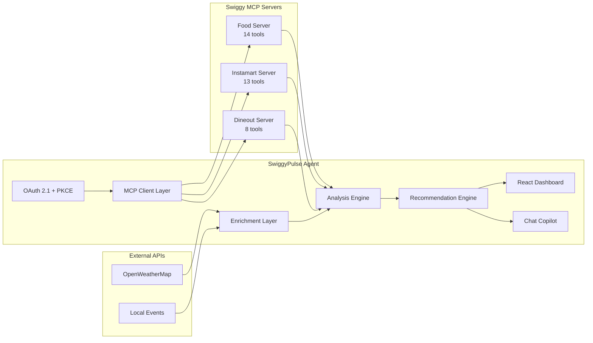

# SwiggyPulse

> AI-powered growth copilot for Swiggy restaurant partners. Built on Swiggy's MCP APIs.


## What is SwiggyPulse?

SwiggyPulse helps restaurant partners on Swiggy increase order volume and optimize menu performance. It analyzes order patterns, delivery performance, coupon effectiveness, and cross-references with external signals like weather and local events to **generate actionable growth recommendations** — not vanity dashboards.

**Example insight:** *"Your Chicken Biryani orders spike 1.6x on rainy evenings. Forecast shows 3 rainy days this week and you have no weather-triggered promotions. Estimated upside: ₹10,000+ in incremental orders."*

The goal: **healthier restaurants → more supply → more orders → stronger Swiggy marketplace.**

## Architecture



| Layer | What it does |
|---|---|
| **MCP Client** | Connects to Swiggy Food / Instamart / Dineout MCP servers via OAuth 2.1 + PKCE. Swappable: `USE_MOCK=true` for the bundled mock, `false` for live. |
| **Analysis Engine** | Computes restaurant- and item-level metrics: revenue, AOV, cancellation rate, peak hours, repeat-customer rate, weather correlation, coupon ROI. |
| **Enrichment Layer** | Weather (OpenWeatherMap), time-of-day patterns, local events. Augments raw order data with external signals. |
| **Recommendation Engine** | Claude-powered insight generator. Produces 8-12 prioritized, dollar-quantified actions per restaurant. |
| **Dashboard** | React + Tailwind + Recharts. 7 pages: overview, menu, coupons, weather, recommendations, dine-in, chat. |
| **Chat Copilot** | Conversational interface. "Why did orders drop last Tuesday?" → data-backed answer. |

## Quick Start

### Prerequisites
- Node.js 20+
- pnpm 10+ (or use `corepack enable`)

### Install & Run
```bash
git clone https://github.com/EigenAx2Pi/swiggypulse.git
cd swiggypulse
pnpm install
pnpm generate:mock   # generates 90 days of correlated mock orders + weather
pnpm dev             # server :3001 + web :3000
```

Open `http://localhost:3000`. Runs in **mock mode** by default — no Swiggy credentials required.

### Environment Variables

All optional in mock mode.

```env
USE_MOCK=true                       # set to false when Swiggy staging credentials are issued

# Swiggy MCP — issued by Builders Club after acceptance
SWIGGY_CLIENT_ID=
SWIGGY_CLIENT_SECRET=
SWIGGY_MCP_FOOD_URL=https://mcp.swiggy.com/food
SWIGGY_MCP_INSTAMART_URL=https://mcp.swiggy.com/im
SWIGGY_MCP_DINEOUT_URL=https://mcp.swiggy.com/dineout

# Anthropic — chat falls back to pre-canned responses if missing
ANTHROPIC_API_KEY=

# OpenWeatherMap — falls back to mock weather if missing
OPENWEATHER_API_KEY=
```

## MCP Integration

SwiggyPulse connects to all three Swiggy MCP servers:

| Server | Tools used | Purpose |
|---|---|---|
| **Food** | `get_addresses`, `search_restaurants`, `get_restaurant_menu`, `get_food_orders`, `fetch_food_coupons` | Order history, menu data, coupon performance |
| **Instamart** | `search_products`, `your_go_to_items` | Cross-sell signals and category demand |
| **Dineout** | `search_restaurants_dineout`, `get_restaurant_details`, `get_available_slots` | Dine-in vs delivery pattern analysis |

The mock layer (`packages/mcp-mock`) returns realistic responses matching Swiggy's documented schemas. Mock data is **deterministically generated** — patterns (rain → biryani spike, weekend lift, evening peak, coupon AOV lift) are reproducible across runs.

## Pages

| Page | Highlights |
|---|---|
| **Dashboard** | 30-day metric cards, daily order chart with rainy-day overlay, top items, hourly heatmap |
| **Menu Performance** | Sortable table of all items — units sold, revenue, rating, trend. Click for item-level detail |
| **Coupon Analysis** | Per-coupon redemption count, AOV lift, estimated discount cost, ROI |
| **Weather Impact** | Pearson correlation, scatter plot, weather-sensitive items, opportunity calendar |
| **Recommendations** | 8-12 AI-generated actions, prioritized, with dollar estimates |
| **Dine-in vs Delivery** | Weekly comparison from Swiggy Dineout vs delivery patterns |
| **Chat Copilot** | Conversational interface — natural language queries against your data |

## Project Structure

```
swiggypulse/
├── packages/
│   ├── mcp-mock/        # Mock Swiggy MCP clients + generated seed data
│   ├── server/          # Express + analyzer + recommendations + chat
│   └── web/             # React + Vite + Tailwind dashboard
├── docs/screenshots/    # Auto-generated via scripts/smoke.mjs
├── scripts/smoke.mjs    # Playwright smoke test — drives all 7 pages
└── .env.example
```

## Compliance

- **Data residency:** Designed for AWS Mumbai (ap-south-1)
- **PII handling:** No PII stored at rest — session-scoped processing only
- **DPDP 2023:** Swiggy-originated data governed by platform terms
- **Error handling:** Exponential backoff with jitter, check-then-retry for non-idempotent calls

## Status

**Prototype (Mock Data)** — Awaiting Swiggy Builders Club staging credentials to connect to live MCP endpoints. The MCP client layer is a one-line swap (`USE_MOCK=false`).

## License

MIT

---

*Powered by Swiggy MCP · Built for [Swiggy Builders Club](https://mcp.swiggy.com/builders)*
