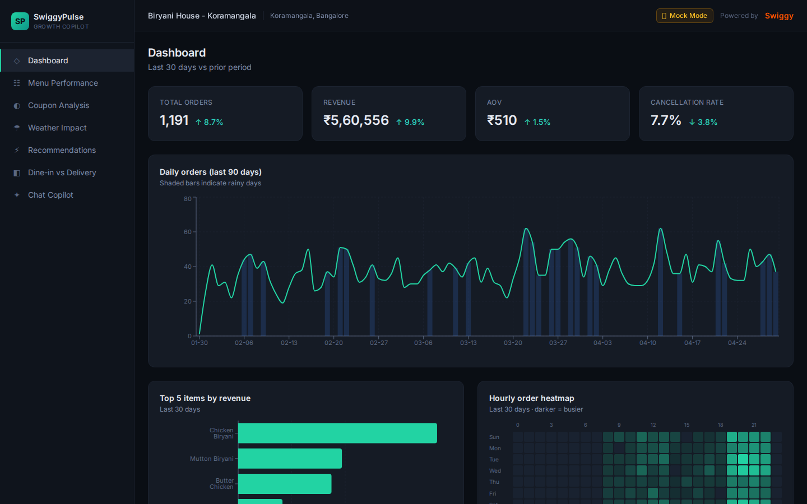

# SwiggyPulse — archived

> A restaurant-analytics copilot built against Swiggy's MCP servers, **archived because
> live testing disproved its premise.** What's left is a working, live-verified reference
> implementation of **MCP OAuth 2.1 + PKCE + Dynamic Client Registration** against a real
> production authorization server — plus an honest record of what the platform actually
> exposes, which contradicted what its docs implied.

> [!IMPORTANT]
> **Not affiliated with, endorsed by, or connected to Swiggy.** This is an independent
> project built against Swiggy's public [Builders Club](https://mcp.swiggy.com/builders)
> MCP servers. "Swiggy" is their trademark, used here only to describe what this code
> talks to. No production integration agreement was signed; this never ran anywhere but
> localhost.

**Status: closed. Not maintained. Do not deploy.** See [DECISIONS.md](./DECISIONS.md) for
the full autopsy and [STATUS.md](./STATUS.md) for the state at close.

---

## The useful part: what Swiggy's MCP actually exposes

This is the reason the repo still exists. All of it was **verified live** on 2026-07-02
against `https://mcp.swiggy.com`, and some of it contradicted the documentation.

**Auth works, and it's more open than expected.**

| Finding | Detail |
|---|---|
| Issuer | `https://mcp.swiggy.com/auth` — *not* the `/oauth/authorize` path an earlier guess assumed |
| Dynamic Client Registration | **Open and unauthenticated.** `POST /auth/register` issues `client_id: swiggy-mcp` |
| Client type | Public client — `token_endpoint_auth_method: "none"`. No client secret |
| Signed agreement | **Not required for localhost.** The PAN/agreement form gates *production* only |
| Token | Bearer, **~5-day expiry, no refresh token issued** |
| Scopes | `mcp:tools mcp:resources mcp:prompts` — granted all-or-nothing |

**But the servers are consumer-only, and that is what killed the product.**

`listTools()` against all three servers (`/food`, `/im`, `/dineout`) returns only consumer
ordering verbs — search → cart → `place_food_order` / checkout / `book_table` → track.
**There is no merchant or partner analytics tool anywhere:** no sales reports, no partner
order history, no menu-performance data, no covers. `get_food_orders` returns the
*signed-in user's own* orders, not a restaurant's sales.

So a restaurant-partner analytics copilot cannot be built on this platform, and no
approval or signed agreement changes that. If you are planning something merchant-shaped
against Swiggy's MCP: it will not work. That finding is the main thing this repo has to
offer you.

## Why the consumer pivot was also killed

The obvious salvage — re-aim it as a consumer app reading your own order history — was
scoped and then cancelled at the gate, before any code was written. Four reasons, any one
sufficient:

1. **The platform ships it as its own hello-world.** Swiggy's Builders Club material
   advertises exactly this: *"AI assistants like Claude analyze your Swiggy order history
   and give personalised insights on food habits and spending."* Connect the MCP to Claude
   and type one sentence — no app required.
2. **The category is saturated and free** — Snackalytics, Swiggy Order Stats, fooddy.in,
   Spenddy, `mr-karan/swiggy-analytics`.
3. **The data source has open upstream defects** — Swiggy's manifest repo carries
   unanswered issues [#36](https://github.com/Swiggy/swiggy-mcp-server-manifest/issues/36)
   (`get_orders` returns stale data, frozen ~2 weeks back) and
   [#15](https://github.com/Swiggy/swiggy-mcp-server-manifest/issues/15) (`get_orders`
   returns 0 orders).
4. **It could never reach a second user** — production needs the unsigned agreement, and
   the server is single-tenant by construction.

Full reasoning in [DECISIONS.md](./DECISIONS.md).

## What's worth reading in the code

| Path | Why |
|---|---|
| [`packages/server/src/auth/oauth.ts`](packages/server/src/auth/oauth.ts) | Server-side `OAuthClientProvider` for the MCP SDK. Handles the problem the SDK's own examples skip: a **browser** OAuth flow spanning two HTTP requests, rather than a blocking CLI redirect. Includes CSRF `state` with one-time replay protection. |
| [`packages/server/src/mcp/client.ts`](packages/server/src/mcp/client.ts) | Streamable-HTTP transport, one connection per server sharing a single login, lazy connect, `listTools()` logging on connect. |
| [`packages/server/src/mcp/adapters.ts`](packages/server/src/mcp/adapters.ts) | Per-tool shape validators that coerce live output into expected types and degrade rather than crash on drift. |
| [`packages/mcp-mock/src/generate.ts`](packages/mcp-mock/src/generate.ts) | Deterministic correlated seed generation — rain → volume lift, weekend lift, evening peak, Pareto customer base. |

> [!WARNING]
> **Known defects — fix before reusing this code.**
> - `isAuthorized()` only checks whether a token *exists*, never whether it expired, and
>   the connected-server set is never cleared. After the ~5-day expiry the client degrades
>   to mock data permanently, with no re-auth path short of a process restart.
> - Credentials are in-memory only, so every restart forces a fresh DCR + browser login.
> - Single-tenant by construction (module-level singleton client, unkeyed response cache).
>   Safe on localhost for one person; **unsafe to host as-is.**

## Running it

Mock mode only. Live mode still connects, but every call returns consumer-shaped data the
merchant analyzer can't use, so it falls back to mock anyway.

```bash
pnpm install
pnpm generate:mock   # required — seed data is generated, not committed
pnpm dev             # server :3001 + web :3000
```

Open `http://localhost:3000`. No credentials needed.

```env
USE_MOCK=true         # false = hit live Swiggy MCP (self-registers via DCR, no secret)
ANTHROPIC_API_KEY=    # absent → chat falls back to pre-canned replies
OPENWEATHER_API_KEY=  # absent → mock weather
LIVE_STRICT=1         # disable mock fallback, surface raw live shapes
```

`pnpm generate:mock` is **required** before the first run — seed data is deliberately not
committed, so that a live-mode run can never write a real person's order history into
tracked files.

## Data handling

The honest version, replacing the aspirational compliance section this README used to
carry:

- **Localhost-only personal tool.** Never hosted; no production agreement signed.
- **Nothing persists.** No database; tokens and responses are in-memory and die with the
  process. That is a consequence of the design, not a compliance control.
- **No real data in the repo.** Seed data is generated and gitignored, and
  `scripts/smoke.mjs` refuses to run in live mode so screenshots cannot capture real
  orders.
- **Not DPDP-scoped** as a single-user personal tool. It *would* be, immediately, if
  hosted for anyone else — and the architecture above is not fit for that.

## Structure

```
packages/mcp-mock/   # mock MCP clients + deterministic seed generator
packages/server/     # express + OAuth/MCP client + analyzer + recommendations + chat
packages/web/        # react + vite + tailwind dashboard (7 pages, mock data)
scripts/smoke.mjs    # playwright smoke test; refuses to run in live mode
```



*The screenshots in `docs/screenshots/` show the merchant dashboard on **generated mock
data**. No real order data appears anywhere in this repository.*
